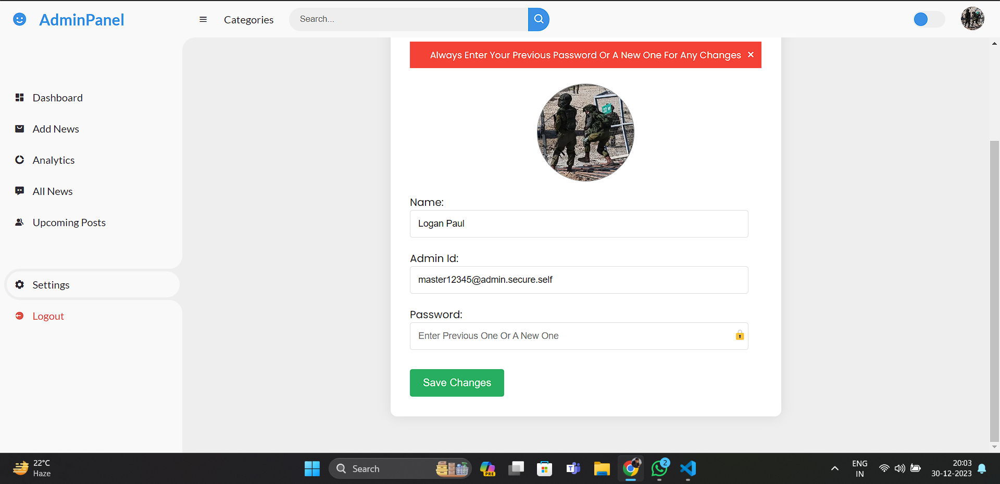

# NewsPortal

Welcome to NewsPortal, a web-based news portal where users can read the top news of the day. Additionally, there is an Admin Panel that allows administrators to log in and manage posts, including updating, creating, and deleting them.NewsPortal is a dynamic, full-stack MERN (MongoDB, Express, React, Node.js) news website that provides a comprehensive platform for news consumption and management. Built with React for the frontend and Node.js for the backend, this project delivers an immersive news experience, offering both users and administrators robust functionalities.

<b>Work in Progress....</b>

## How to Run

Follow these steps to run the project locally:

1. Open the Command Line by pressing Win + r and then typing 'cmd'.
2. Clone the GitHub repository: 'git clone https://github.com/Phinix-BI/News-Portal-U.V-.git'
3. Change the directory to the project folder: 'cd News-Portal-U.V-'
4. Run `npm init -y` in the main directory.
5. Install dependencies by running `npm install`.
6. Navigate to the `client` directory and install frontend dependencies using `npm install`.
7. Create an `.env` file in the backend and configure the following:

   ```env
   clientUrl=Replace with you frontend url //Example http://localhost:3001
   BASEURL=Replace with you frontend url //Example http://localhost:3000
   saltRounds=10
   masterid=yourID@admin.self.com
   masterPass=strongKey
   sessionKey=strongKey

8. Similarly, in the backend directory, install backend dependencies with `npm install`.

9. Go to the main directory and run `npm start`. By default, the client's package.json sets the port to 3001 for running, but you can change it according to your preferences.

10. The initial login using the master ID and password, as well as the port configuration flexibility for the client's side.

## Tools & Technology

<b>Frontend</b>

- HTML
- CSS
- JavaScript
- Bootstrap
- Axios for frontend and backend integration
- EJS for the Admin Panel
- Multer for image uploading
- React

<b>Backend</b>

- Node.js
- exprees.js
- MongoDB with Mongoose for database management
- Bcrypt for password protection
- Session for login sessions in the Admin Panel

## Plugins

- Express.js

## Features

### User Interface
The user interface is thoughtfully designed, providing category-based news sections for easy navigation. An intuitive sidebar showcases advertisements and highlights short features, enhancing the overall user experience.

### Admin Panel
The admin panel is a powerhouse, offering a complete suite of tools for content management. From a versatile dashboard to adding and scheduling news articles, administrators have granular control. The panel includes a route for accessing all uploaded news, settings for customization, and a secure log-out option. Passwords are securely hashed using bcrypt, ensuring data integrity.

- Admin authentication with secure password storage.
- Create new posts.
- Update existing posts.
- Delete posts.

## Admin Credentials

To access the Admin Panel, use the following credentials:

- Username: [YourAdminUsername]
- Password: [YourAdminPassword]

Please make sure to change these credentials for security reasons.

## Database

This project uses MongoDB to store news posts and user data. Configure your database settings in the project's configuration file.

## UI/UX

The user interface is designed to be user-friendly and visually appealing. It's responsive and works well on different devices.

## Security

Security is a top priority. Passwords are securely stored, and user authentication is implemented using Session. Always follow best practices for security.

- Passwords are securely encrypted using bcrypt.
- Session-based authentication is implemented for secure logins.
- Whitelisting ensures secure frontend and backend integration.

## Deployment

To deploy this project, you can use hosting platforms like Heroku, AWS, or deploy it on a VPS (Virtual Private Server).

## Feedback and Contributions

We welcome feedback and contributions from the community. If you have any suggestions or find any issues, please create an issue or submit a pull request.

## Acknowledgement

The frontend user interface utilized in the client-side development of this project was adapted from [sunil9813/News-Website]. We extend our gratitude for their valuable contribution to enhancing the frontend experience of this news portal.

## Bugs

<b> News Counter & Scheduled Posts Check </b>

- News Counter Bug: Upon the first post, the news counter fails to reflect the response initially. However, this issue resolves itself after the second post.

- Scheduled Posts Check Bug: Inconsistencies arise during the scheduled posts check, resulting in occasional errors.

### Ongoing Fixes
Efforts are ongoing to resolve these issues. Regular debugging and updates are in progress to ensure a smoother user experience.

## License

This project is licensed under the ©The Devloper Guy License. See the LICENSE.md file for details.

## Connect with Us

📧 **Email:** thedeveloperguy23@gmail.com

📸 **Instagram:** [https://www.instagram.com/_thedeveloperguy] - Follow us for updates and behind-the-scenes insights!
